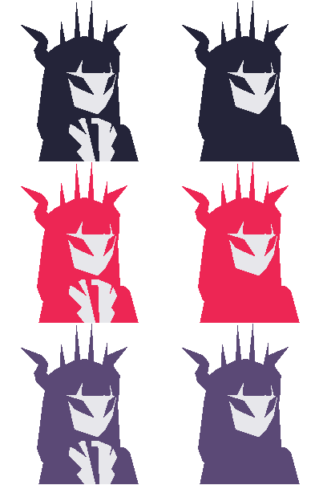
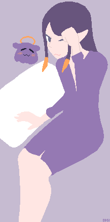
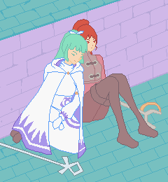
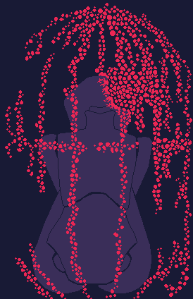
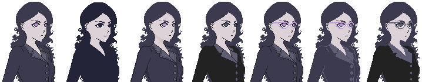

## Instructions

The scripts must be executed from their respective directories, e.g. `cd BPY; ./01CubesGridWave.py`.

## [Blender/](Blender/)
Screenshot | Description
 --- | ---
 | [**Helltaker Lucifer x Hollow Knight**](Blender/01HollowLucifer/main.blend) · [Reference](https://www.pixiv.net/en/artworks/84569040)
 | [**Bedroom**](Blender/02Bedroom/scene.blend)

## [BPY/](BPY/)

Screenshot | Description
 --- | ---
 | [**Limb topology**](BPY/04LimbTopology.py) · [Reference](http://wiki.polycount.com/wiki/Limb_Topology)
 | [**Newscaster**](BPY/03NewsCaster.py) · [Reference](https://www.models-resource.com/playstation/megamanlegends/model/34942/)
 | [**Cube Owl**](BPY/02CubeOwl.py) · [Reference](https://studio.blender.org/training/primitive-animals/)
 | [**Animated grid of cubes**](BPY/01CubesGridWave.py) · [Reference](https://www.youtube.com/watch?v=QnvN1dieIAU)

## [OpenSCAD/](OpenSCAD/)

Screenshot | Description
 --- | ---
 | [**Night light enclosure**](OpenSCAD/tools/nightlight.scad)
 | [**Technic beam**](OpenSCAD/tools/beam.scad)

## [PixelArt/](PixelArt/)

Illustration | Description
 --- | ---
  | **Hollow Lucifer**
 | **Sleepy Ina'nis**
 | **Mask**
 | **Mia x Jenna Golden Sun**
 | **Eldritch doll**
 | **Avatar**

## [SVG/](SVG/)

Illustration | Description
 --- | ---
 | **Magic circle**

## [Scripts/](Scripts/)

Output | Description
 --- | ---
 | [**Stylized eye texture**](Scripts/EyeTexture.py)
 | [**Dimetric grid**](Scripts/DimetricGrid.py)
